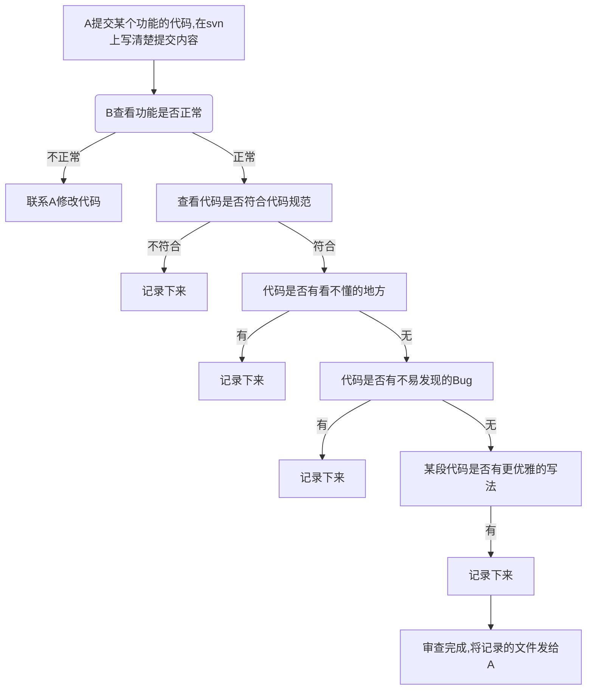

# 媒体产品部前端代码审查(Code Review)方案

[toc]

## **1.摘要** 

在前端团队实现代码审查(code review)，统一团队代码规范，降低bug率。在每次svn提交之后，同一个项目的成员去进行代码审查，确认功能是否正常，代码是否符合代码规范。

## **2.目标** 

* 统一团队的编码规范
* 降低bug率
* 提高代码质量
* 加深团队成员之间沟通

## **3.非目标** 

不降低现有开发效率

## **4.成功的度量标准** 

更少的bug率

## 5. 前置条件

### 5.1 统一的项目规范

每个项目需要具有统一的项目规范，不然不知道去审查哪些内容，目前项目使用的规范如下：

* 拨测规范
    * [通用规范](common.html)
    * [vue单页应用开发规范](vue-single.html)
* 企业视频彩铃管理员网站
    * [通用规范](common.html)
    * [vue多页开发规范](vue-multiple.html)
* 铃音模板制作
    * [通用规范](common.html)
    * [vue多页开发规范](vue-multiple.html)

### 5.2 统一的svn提交规范

* 使用便于查看`单个文件的变更历史`及`版本变更历史`的工具，推荐vscode的svn插件 [vscode插件](vscode-svn.html)
* [svn提交规范](svn-norm.html)

## 6. 描述

### 6.1 审查方式

#### 分项目进行

* 拨测
    * 黄养滕 ——》邬丽娇 ——》李鹏——》樊玉玲 ——》严露——》黄养滕
* 企业
    * 黄养滕——》严露——》李鹏——》黄养滕
* 铃音模板
    * 黄养滕——》邬丽娇

####  代码审查之前先进行功能测试

审查代码之前，先测试下功能是否正常，如果功能不正常，就先让对方修改功能，修改完成后再进行review

### 6.2 审查内容

* 实现的功能是否有问题
* 界面样式是否兼容不容尺寸屏幕
* 代码是否符合规范
* 代码是否有冗余
* 代码是否有看不懂的地方
* 代码是否有不易发现的bug
* 代码是否可以优化

### 6.3 审查流程

以`A提交代码，B去审查A的代码`为例

### 6.4 记录工具

* 截图工具 
    * windows  qq截图|snipaste
    * mac xnip
* 文本编辑器
    * typora

### 6.5 记录格式

#### 示例

* [codeReview-20191121-拨测-首页]()
* [codeReview-20191121-拨测-任务]()

#### 注意事项

* 截图要清晰，出现问题的地方要标注，同时要出现代码所在文件，代码所在行号（多截一点）

## 8.风险

